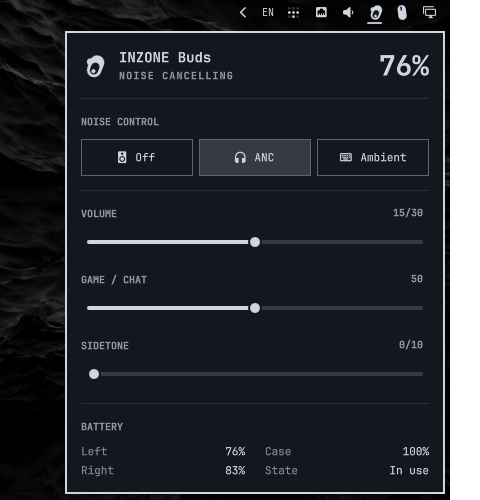

# omarchy-mouse-angle

Per-mouse sensor angle for the [Omarchy](https://omarchy.org/) bar. It rotates
a mouse's pointer input by whole degrees - the way a vendor driver's
angle/sensor-angle setting does, but for any mouse, because Hyprland applies
it through libinput's device rotation. Nothing is written to the mouse.

Useful for lining a second mouse up with your main one, or for a sensor that
sits slightly skewed in the shell.



The bar shows a mouse glyph tilted by the selected mouse's angle (upright =
no rotation); the exact value is in the tooltip and panel.

## Install

Requires Omarchy with Hyprland >= 0.56 (Lua config, `hyprctl eval`).

```sh
git clone https://github.com/kazedayo/omarchy-mouse-angle \
  ~/.config/omarchy/plugins/io.github.kaz.omarchy-mouse-angle

omarchy bar put io.github.kaz.omarchy-mouse-angle --section right
omarchy restart shell
```

Then make Hyprland load the angle table at startup - add to
`~/.config/hypr/hyprland.lua`:

```lua
local require_optional = require("default.hypr.require_optional")
require_optional.module("hypr.mouse-angle")
```

and `hyprctl reload`. The widget creates `~/.config/hypr/mouse-angle.lua` on
first use.

## Usage

Click the bar glyph to open the panel:

- **MOUSE** - pick which mouse to adjust. Only standalone mice are listed;
  composite keyboard nodes (e.g. a Wooting 60HE's mouse interface) are
  hidden.
- **ANGLE** - `-5 -1 +1 +5` steps, a `0` reset, and a slider for coarse
  jumps. Arrow keys adjust too (left/right = 1 degree, up/down = 5).

Degrees are clockwise, 0-359, matching libinput: 353 is 7 degrees
anticlockwise. Values 160-220 also invert wheel direction, per libinput.

## How it works

- Changes apply immediately with `hyprctl eval 'hl.device({ name = ...,
  rotation = N })'`.
- The same values are mirrored into `~/.config/hypr/mouse-angle.lua`, which
  the loader line above pulls in, so settings survive reloads and reboots.
  The file is generated - edit it through the widget, or by hand followed
  by `hyprctl reload`.
- Rotation is a device-level correction (physics in, pointer out), applied
  by libinput before acceleration. It is not firmware, and not per-game.

Direction convention, measured on Hyprland 0.56.2 / libinput 1.31.3 by
injecting a pure +x motion and reading `hyprctl cursorpos`:

| rotation | measured angle of motion |
|----------|--------------------------|
| 0        | 0.0 deg                  |
| 30       | +30.1 deg (clockwise)    |
| 353      | -7.2 deg (anticlockwise) |

## Layout

| File | Purpose |
|------|---------|
| `Panel.qml` | Bar button + panel, all Hyprland interaction |
| `MouseIcon.qml` | The tilted mouse glyph |
| `Model.js` | Pure logic: parse/format the Lua table, angle labels, device filtering |
| `test_model.js` | `node test_model.js` - checks the above |
| `screenshot.png` | Panel on the bar (workspace 1) |

## License

MIT
