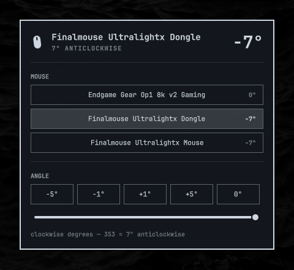

# omarchy-mouse-angle

Per-mouse sensor angle for [Omarchy](https://omarchy.org/): rotates a mouse's
pointer input by whole degrees via Hyprland/libinput device rotation — the
driver setting vendors gate behind Windows software, for any mouse.

A standalone panel, not a bar widget: summoned from the omarchy menu
(**Trigger → Hardware → Mouse Angle**) and shown as a centered card on a dimmed
backdrop. Nothing sits in the toolbar.



## Install

Requires Omarchy (Hyprland >= 0.56, Lua config).

```sh
git clone https://github.com/kazedayo/omarchy-mouse-angle \
  ~/.config/omarchy/plugins/io.github.kaz.omarchy-mouse-angle
```

Apply the generated rotation at Hyprland start — add to
`~/.config/hypr/hyprland.lua`, then `hyprctl reload`:

```lua
local require_optional = require("default.hypr.require_optional")
require_optional.module("hypr.mouse-angle")
```

Optional menu entry in `~/.config/omarchy/extensions/omarchy-menu.jsonc`:

```jsonc
"trigger.hardware.mouse-angle": {"icon":"󰍽","label":"Mouse Angle","action":"omarchy-shell shell summon io.github.kaz.omarchy-mouse-angle"},
```

## Usage

Pick a mouse, then adjust with the step buttons, the slider, or arrow keys
(`←`/`→` ±1°, `↑`/`↓` ±5°, `Tab` switches mice, `Esc` closes). Degrees are
clockwise, 0–359 — 353 is 7 degrees anticlockwise. Changes apply immediately
and persist to the generated `~/.config/hypr/mouse-angle.lua` (edit by hand,
then `hyprctl reload`).

Settings are keyed by the mouse's hardware id (`bus:vendor:product[:serial]`),
so they survive renames, re-plugging, and identical-model duplicates.

## Scripting

```sh
omarchy-shell shell summon io.github.kaz.omarchy-mouse-angle   # open
omarchy-shell shell toggle io.github.kaz.omarchy-mouse-angle   # toggle
```

While open, the direct IPC target answers
`omarchy-shell io.github.kaz.omarchy-mouse-angle open|close|toggle|query`.

## Development

`node test_model.js` runs the logic tests. MIT.
